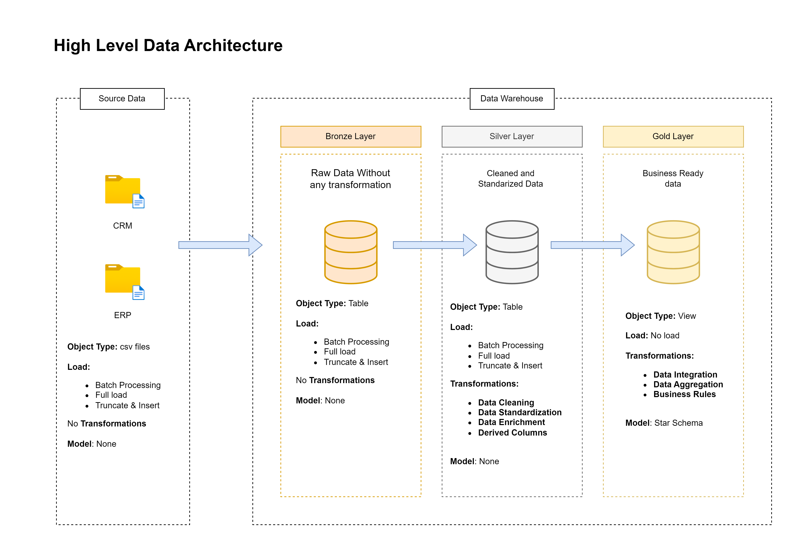
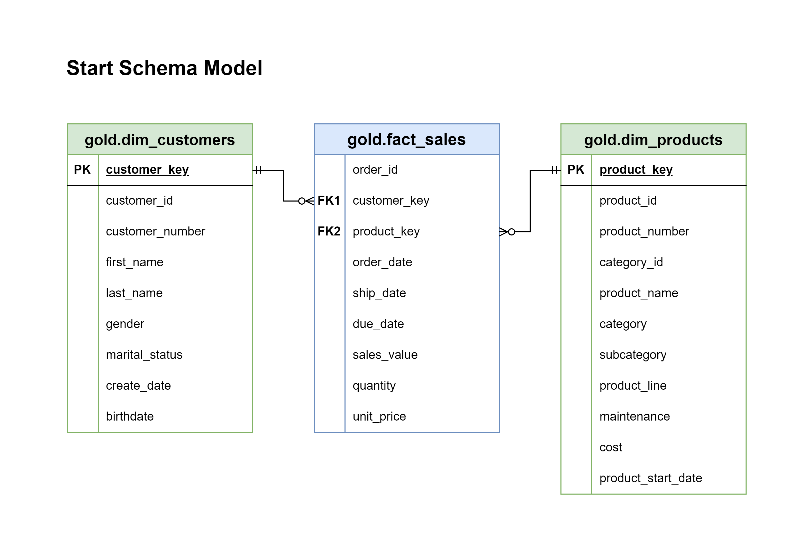

# SQL Server DATA WAREHOUSE PROJECT

## 📌 Project Overview
This project involves building a **SQL Server-based Data Warehouse** with an **ETL pipeline** to process and integrate data from ERP and CRM systems. The solution follows the **Medallion Architecture** (Bronze, Silver, Gold layers) and ensures optimized reporting with a **star schema**.

## 📂 Data Sources
- **CRM System:** Provides CSV files with:
  - `sales_details` (transactional data)
  - `customer_info` (customer details)
  - `product_info` (product details)
- **ERP System:** Provides three additional CSV files with customer and product information.
- **CSV File Characteristics:**
  - Comma-delimited
  - Includes headers
  - No schema enforcement at the source

## 🏗️ Architecture
The project follows the **Medallion Architecture**, structured as:

### 1️⃣ Bronze Layer (Raw Data)
- Stores into tables the CSV files data from ERP and CRM.
- Ingested via **stored procedures** in SQL Server.
- No transformations applied at this stage.

### 2️⃣ Silver Layer (Cleaned & Processed Data)
- Data is cleansed and validated.
- **Deduplication, type conversions, missing value handling.**
- Stored in structured tables.

### 3️⃣ Gold Layer (Business Intelligence Schema)
- Star schema designed for analytical queries.
- Views are created for BI consumption.
- Indexed and optimized for fast querying.

## 🛠️ Technologies Used
- **Database:** Microsoft SQL Server
- **Storage:** CSV files stored locally or in cloud storage
- **Automation:** **SQL Server Agent** for scheduled executions.

## 🔄 Data Transformations
Many transformation and cleansing technique were used in the project:
- Remove duplicates
- Data Filtering
- Handeling missing data
- Handeling invalid values
- Handeling unwanted spaces
- Data type casting
- Data normalisation & standardization
- Data enrichment
- Derived columns
- Data aggregation
- Data integration

All the transformation are detailed in [doc/data_transformation.md](doc/data_transformation.md)

## 📊 Data Model
- **Fact Table:** `fact_sales`
- **Dimension Tables:**
  - `dim_customer`
  - `dim_product`
- **Relationships:**
  - `fact_sales` links to `dim_customer` and `dim_product` via foreign keys.
 
 

## 📝 Documentation & Project Management
- **Data Architecture Diagrams** 📌 : [doc/data_architecture.png](doc/data_architecture.png)
- **Data Flow Diagrams** 🔄 : [doc/data_flow.png](doc/data_flow.png)
- **Data Catalog** 📚 : [doc/data_catalog.md](doc/data_catalog.md)
- **Naming Conventions** (`snake_case` for consistency) 🏷️ : [doc/naming_convention.md](doc/naming_convention.md)
- **Conceptual Model & Star Schema Design** 🌟 : [doc/star_model.png](doc/star_model.png)

The project was managed using an **Agile methodology** with **Notion** ([link for the Notion page](https://mewing-pyjama-a13.notion.site/SQL-Server-Data-Warehouse-Project-1be923a250a58037b793ca6330c2fd57)) 

## 🚀 Execution & Automation
- **Stored Procedures** were used to load and transform data:
  - `bronze.load_bronze`
  - `silver.load_silver`
  - Views created for **gold layer** reporting.
- **Triggering ETL Process:**
  - **SQL Server Agent** for scheduling.

## ✅ Project Deliverables
✔️ Fully operational **ETL pipeline** in SQL Server.
✔️ **Star schema** for analytical reporting.
✔️ Documented **data sources, transformations, data flow, and schema**.
✔️ **Optimized performance** for large-scale processing.
✔️ **Error-handling mechanisms** for reliability.

📌 **Author:** Amine Mohabeddine  